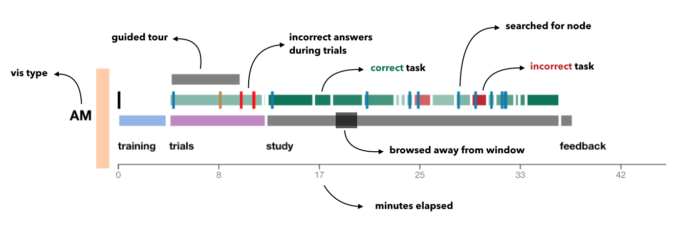

# Survey Data and Analysis Scripts for User Intent Crowdsourced study

This repository contains all the survey results from the User Intent crowdsourced study as well as the R scripts used to analyze them and the d3 code used to generalize an interactive visualization of the provenance data.

### Survey 
The User Intent crowdsourced study itself can be found at  
<!-- [https://github.com/visdesignlab/mvnv-study](https://github.com/visdesignlab/mvnv-study). -->

## Survey Data

The survey data can be found in two formats: JSON for the original data from the firestore database, CSV for exported versions for R processing
## Analysis Code

THe R Scripts used to analyze the results and generate the figures that are included in the paper and in the supplementary pdf can be found in the analysis folder.

## Provenance Visualization

We created a provenance visualization to see how users interacted with he study. You can access the live version or run the visualization locally on your machine.

### Live version

A live version of a visualization of the provenance data collected during the survey can be found at [https://vdl.sci.utah.edu/intent-study-analysis/](https://vdl.sci.utah.edu/intent-study-analysis/).

### Run locally

In order to see the provenance visualization locally, download this repo and run a local server such as http-server.

